# Testbed-IAC

Infrastructure-as-code tooling for the [FABRIC](https://fabric-testbed.net/) national research testbed. Manage FABRIC slices, nodes, networks, and components declaratively with Terraform.

## Ecosystem

## Repositories

| Repository                                                                                    | Description                                                                                                                                                                                        |
| --------------------------------------------------------------------------------------------- | -------------------------------------------------------------------------------------------------------------------------------------------------------------------------------------------------- |
| [terraform-provider-fabric](https://github.com/Testbed-IAC/terraform-provider-fabric)         | Terraform provider for FABRIC. Published on the [Terraform Registry](https://registry.terraform.io/providers/Testbed-IAC/fabric). Manages slices, nodes, components, networks, and facility ports. |
| [terraform-fabric-modules](https://github.com/Testbed-IAC/terraform-fabric-modules)           | Reusable Terraform modules built on top of the provider. Composable building blocks for common FABRIC topologies.                                                                                  |
| [fabric-go-fim](https://github.com/Testbed-IAC/fabric-go-fim)                                 | Go port of the FABRIC Information Model. Builds and serializes FIM topologies consumed by the provider.                                                                                            |
| [fabric-orchestrator-go-client](https://github.com/Testbed-IAC/fabric-orchestrator-go-client) | Go client for the FABRIC Orchestrator REST API. Handles slice lifecycle, sliver state, and POA requests.                                                                                           |

## License

All repositories in this organization are licensed under [MIT](https://opensource.org/licenses/MIT).
